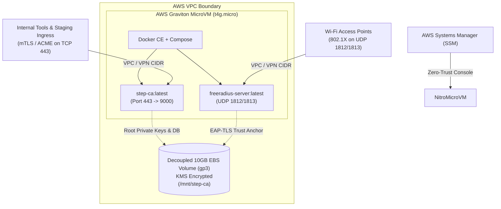

# Production Private CA & RADIUS Stack (OpenTofu)

[](https://opentofu.org/)
[](https://aws.amazon.com/ec2/graviton/)
[](https://aws.amazon.com/ec2/nitro/)
[](LICENSE)

A production-grade, low-touch **Private Certificate Authority (CA)** and **Network Access Control (RADIUS)** infrastructure managed via OpenTofu. Designed to manage mutual TLS (mTLS) and internal HTTPS certificates across 10 staging/internal tools and provide the cryptographic foundation for 802.1X EAP-TLS Wi-Fi network authentication.

---

## Architecture Overview

- **Compute & Hypervisor Isolation**: AWS EC2 `t4g.micro` running Ubuntu 24.04 LTS Minimal (ARM64) on the hardware-enforced **AWS Nitro Hypervisor**.
- **Cryptographic Key Custody**: Decoupled, KMS-encrypted **10 GiB EBS volume (`gp3`)** with `lifecycle { prevent_destroy = true }`. Root private keys and the embedded database persist independently of the ephemeral compute instance.
- **Zero-Trust Access**: Managed exclusively via **AWS Systems Manager (SSM) Session Manager** (`AmazonSSMManagedInstanceCore`). Inbound SSH (port 22) is completely closed by default.
- **Container Services**:
  - **Smallstep CA (`smallstep/step-ca:latest`)**: Automated PKI, ACME, and internal mTLS endpoints listening on external TCP 443 (internally routed to port 9000).
  - **FreeRADIUS (`freeradius/freeradius-server:latest`)**: Network access control for 802.1X EAP-TLS listening on UDP 1812 (Authentication) and UDP 1813 (Accounting).



---

## Repository Structure

| File | Purpose |
| :--- | :--- |
| [`providers.tf`](providers.tf) | Declares OpenTofu `>= 1.6.0` and required providers (`aws ~> 5.0`, `random ~> 3.6`). |
| [`variables.tf`](variables.tf) | Strongly typed inputs for region, networking, compute sizing, and CA naming. |
| [`main.tf`](main.tf) | Core resources: Security Group isolation, IAM SSM profile, decoupled EBS, and EC2 MicroVM. |
| [`outputs.tf`](outputs.tf) | Outputs for CA endpoint URL, sensitive passwords, and quickstart commands. |
| [`user_data.sh`](user_data.sh) | Cloud-init bash script: Nitro NVMe discovery, non-destructive mount, Docker install, compose generation, and systemd service registration. |
| [`terraform.tfvars.example`](terraform.tfvars.example) | Sanitized variable template for local or multi-environment deployments. |
| [`AGENTS.md`](AGENTS.md) | Operational guidelines, key persistence mandates, and execution guardrails for AI agents. |
| [`CLAUDE.md`](CLAUDE.md) | Developer CLI cheatsheet, HCL style rules, and container/state troubleshooting procedures. |
| [`WALKTHROUGH.md`](WALKTHROUGH.md) | Architectural comparison (MicroVM vs. Kubernetes), deployment walkthrough, verification steps, and Phase 2 Wi-Fi (EAP-TLS) strategy. |

---

## Quick Start

### 1. Configure Variables
```bash
cp terraform.tfvars.example terraform.tfvars
# Customize allowed_cidr_blocks, ca_name, ca_dns, and aws_region
```

### 2. Deploy Infrastructure
```bash
tofu init
tofu fmt -check
tofu validate
tofu plan -out=tfplan
tofu apply tfplan
```

### 3. Retrieve Credentials & Connect via SSM
```bash
# Retrieve auto-generated CA password and FreeRADIUS secret
tofu output -raw ca_password
tofu output -raw radius_secret

# Open a secure shell on the MicroVM (no SSH key required)
aws ssm start-session --target $(tofu output -raw instance_id)
```

### 4. Bootstrap Local Machine / Staging Tools
```bash
# Obtain root CA fingerprint from the running container
docker exec step-ca step certificate fingerprint /home/step/certs/root_ca.crt

# Install root certificate into local OS trust store
step ca bootstrap \
  --ca-url "https://$(tofu output -raw instance_private_ip)" \
  --fingerprint "<ROOT_FINGERPRINT>" \
  --install
```

---

## Documentation Index

- **Engineering Decision & Deployment Guide**: See [WALKTHROUGH.md](WALKTHROUGH.md) for the MicroVM vs. Kubernetes matrix and Phase 2 EAP-TLS integration guide.
- **Operational Rules for AI Agents**: See [AGENTS.md](AGENTS.md) for non-negotiable persistence rules.
- **Developer Instructions**: See [CLAUDE.md](CLAUDE.md) for styling and operational debugging.
