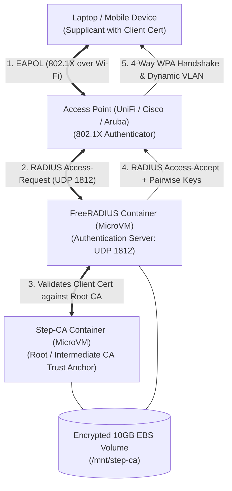
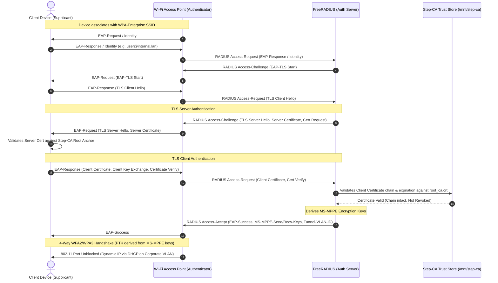

# Architectural Walkthrough: Private CA & RADIUS Infrastructure

> **Document Classification**: Engineering Design, Deployment Guide & Operational Blueprint  
> **Target Audience**: Lead Engineer, Security Architecture Committee, DevOps/SRE Team  
> **Project Scope**: Low-touch, production-grade Private CA (Smallstep) and Network Access Control (FreeRADIUS) on AWS Nitro MicroVM.

---

## 1. Executive Summary & Architectural Justification

To manage mutual TLS (mTLS) certificates across 10 internal tooling and staging environments, and to lay the cryptographic foundation for corporate 802.1X EAP-TLS Wi-Fi authentication, we selected a **standalone AWS MicroVM (`t4g.micro`) on the Nitro Hypervisor** coupled with a **decoupled, encrypted EBS volume (`gp3`)** rather than hosting the PKI stack inside Kubernetes (EKS).

### Architectural Comparison: MicroVM vs. Kubernetes

| Architectural Dimension | Standalone MicroVM (`t4g.micro` on Nitro) | Kubernetes Pod / Deployment (EKS) | Engineering Decision Rationale |
| :--- | :--- | :--- | :--- |
| **Hypervisor & Security Boundary** | **Hardware-enforced isolation**: The AWS Nitro hypervisor isolates CPU and memory directly from the bare metal, ensuring cryptographic memory cannot be inspected by adjacent workloads. | **Shared Linux Kernel**: Containers share a Linux kernel namespace (`cgroups`, `namespaces`). Container escape vulnerabilities compromise all sibling pods. | **Winner: MicroVM**. Root CA private keys require the strongest possible hypervisor boundary. |
| **Key Persistence & Lifecycle** | **Decoupled 10GB Encrypted EBS**: Hardened with `lifecycle { prevent_destroy = true }`. Compute can be destroyed and rebuilt without risking storage deletion. | **Kubernetes PVC / CSI Driver**: Volume attachment relies on the Kubernetes control plane, CSI node drivers, and storage class bindings. | **Winner: MicroVM**. Zero orchestration layers between storage and OS; immune to CSI driver deadlocks or volume unmounting race conditions. |
| **Network Protocol Resilience (UDP RADIUS)** | **Direct Kernel Socket**: Inbound UDP 1812/1813 traffic routes directly from the AWS Nitro Elastic Network Adapter (ENA) to the FreeRADIUS process. | **Overlay Ingress / Kube-Proxy**: UDP traffic must traverse CNI overlays (e.g. AWS VPC CNI / Calico) and `iptables` / `ipvs` NAT tables. | **Winner: MicroVM**. RADIUS is UDP-based. Ingress controllers (like ALB/NLB) introduce connection tracking jitter and packet drops on UDP bursts. |
| **Operational & Upgrade Blast Radius** | **Zero-touch maintenance**: Minimal Ubuntu 24.04 ARM64 with unattended security patches. Zero cluster API deprecations. | **High operational overhead**: Requires ongoing EKS cluster upgrades every 14 months, CSI driver upgrades, and node group rollouts. | **Winner: MicroVM**. A Certificate Authority is a foundational utility that must remain stable for decades without breaking API changes. |
| **Attack Surface Area** | **Minimalist**: Ubuntu Minimal (~40 packages), Docker Engine, and 2 container processes. No cluster-wide API server exposed. | **Expansive**: Kubernetes API server, etcd, kubelet, CoreDNS, metrics-server, daemonsets, and CNI pods. | **Winner: MicroVM**. Minimal codebase and dependencies radically minimize zero-day vulnerabilities. |
| **Monthly Run Rate (Cost)** | **~$4.40 / month**<br>• `t4g.micro` reserved: ~$3.04/mo<br>• 10GB EBS `gp3`: ~$0.80/mo<br>• Snapshots/data: ~$0.56/mo | **~$135.00+ / month**<br>• EKS Control Plane: $73.00/mo<br>• 2x `t4g.small` worker nodes: ~$48.00/mo<br>• EBS & Load Balancers: ~$15.00/mo | **Winner: MicroVM**. **96.7% cost reduction**, freeing budget for other high-leverage security initiatives. |

---

## 2. Step-by-Step Deployment Guide (Zero to Running CA)

Follow this deployment workflow to provision the infrastructure from a clean workstation.

### Step 2.1: Prerequisites
Ensure your local workstation has the following tooling installed:
- [OpenTofu](https://opentofu.org/) (`>= 1.6.0`)
- [AWS CLI](https://aws.amazon.com/cli/) (`>= 2.15`) with the [AWS Session Manager Plugin](https://docs.aws.amazon.com/systems-manager/latest/userguide/session-manager-working-with-install-plugin.html)
- [Step CLI](https://smallstep.com/docs/step-cli/installation/) (Optional, for local certificate interactions)
- Active AWS credentials with permissions to provision EC2, EBS, IAM, and Security Groups.

### Step 2.2: Clone & Configure Variables
1. Navigate into the repository:
   ```bash
   cd stepca-opentofu
   ```
2. Copy the template variable definitions:
   ```bash
   cp terraform.tfvars.example terraform.tfvars
   ```
3. Open `terraform.tfvars` and customize:
   - `aws_region`: Target region (e.g. `us-east-1` or `eu-west-1`).
   - `allowed_cidr_blocks`: Set to your corporate VPC, WireGuard, or office IP range.
   - `ca_name`: Set your organizational Root CA identifier (e.g. `Acme Corp Internal CA`).
   - `ca_dns`: Set your internal DNS hostname (e.g. `ca.internal.net`).

### Step 2.3: Initialize and Validate OpenTofu
```bash
# Initialize OpenTofu and download required providers
tofu init

# Format check and syntax validation
tofu fmt -check
tofu validate
```

### Step 2.4: Execute Plan and Provision
```bash
# Generate deterministic plan
tofu plan -out=tfplan

# Apply the plan to AWS
tofu apply tfplan
```

### Step 2.5: Verify Host Bootstrap Status
The AWS Nitro MicroVM boots Ubuntu 24.04 and executes `user_data.sh`. Monitor the initial cloud-init configuration via AWS Systems Manager (no open SSH ports needed):

```bash
INSTANCE_ID=$(tofu output -raw instance_id)

# Connect interactively or run a non-interactive remote check:
aws ssm start-session --target "$INSTANCE_ID" \
  --document-name AWS-StartInteractiveCommand \
  --parameters command="tail -n 30 /var/log/pki-bootstrap.log"
```

Verify that the containers are healthy:
```bash
aws ssm start-session --target "$INSTANCE_ID" \
  --document-name AWS-StartInteractiveCommand \
  --parameters command="docker compose -f /opt/pki-radius/docker-compose.yml ps"
```

---

## 3. Post-Deployment Verification & Client Bootstrapping

Once the stack is provisioned, configure your local client or staging environment to trust the new Private CA.

### Step 3.1: Retrieve Sensitive Outputs
Extract the auto-generated root passwords:
```bash
# Retrieve Master Root CA Password
tofu output -raw ca_password

# Retrieve FreeRADIUS Shared Secret
tofu output -raw radius_secret
```

### Step 3.2: Extract the Root CA Fingerprint
The root CA fingerprint is required to cryptographically bind client machines to the CA during bootstrap. Retrieve it directly from the running container:

```bash
INSTANCE_ID=$(tofu output -raw instance_id)

FINGERPRINT=$(aws ssm start-session --target "$INSTANCE_ID" \
  --document-name AWS-StartInteractiveCommand \
  --parameters command="docker exec step-ca step certificate fingerprint /home/step/certs/root_ca.crt" \
  | grep -oE '[a-f0-9]{64}')

echo "Root CA Fingerprint: $FINGERPRINT"
```

### Step 3.3: Bootstrap Local Environment
Execute `step ca bootstrap` on your internal servers, developer workstations, or staging environments. This downloads the root certificate and securely installs it into your local OS trust store:

```bash
CA_IP=$(tofu output -raw instance_private_ip)

# Bootstrap trust anchor
step ca bootstrap \
  --ca-url "https://$CA_IP" \
  --fingerprint "$FINGERPRINT" \
  --install
```

### Step 3.4: Issue Your First End-Entity Certificate
Issue a production-grade X.509 certificate for an internal staging service:

```bash
# Request certificate with 24-hour validity
step ca certificate staging.tool.lan staging.crt staging.key \
  --ca-url "https://$CA_IP" \
  --root "$(step path)/certs/root_ca.crt"

# Verify the certificate chain
step certificate inspect staging.crt --short
```

---

## 4. Phase 2 Strategy: Wi-Fi 802.1X (EAP-TLS) Integration Blueprint

The deployed stack provides the exact building blocks required to transition corporate Wi-Fi from insecure pre-shared keys (WPA2/3-Personal) to certificate-based network access control (**WPA2/3-Enterprise with EAP-TLS**).

### Architecture Topology



---

### Handshake Sequence: 802.1X / EAP-TLS Authentication

The sequence below illustrates how an endpoint establishes a zero-trust network connection via the deployed stack:



---

### Step-CA & FreeRADIUS Configuration Blueprint

To operationalize Phase 2, update the FreeRADIUS configuration located on the persistent volume (`/mnt/step-ca/freeradius/`):

#### 1. Configure RADIUS Clients (`/mnt/step-ca/freeradius/clients.conf`)
Define your Wi-Fi Access Points or Wireless LAN Controllers (WLC):
```conf
client corporate_access_points {
    ipaddr      = 10.0.100.0/24
    secret      = <INSERT_RADIUS_SECRET>
    shortname   = unifi_aps
    nas_type    = other
}
```

#### 2. Configure EAP-TLS Module (`/mnt/step-ca/freeradius/mods-enabled/eap`)
Bind FreeRADIUS directly to the Step-CA certificate hierarchy:
```conf
eap {
    default_eap_type = tls
    timer_expire     = 60
    ignore_unknown_eap_types = no

    tls-config tls-common {
        # CA Certificate generated by Step-CA
        ca_file = /mnt/step-ca/step/certs/root_ca.crt

        # Server Certificate and Private Key issued by Step-CA for the RADIUS Server
        certificate_file = /etc/freeradius/certs/radius-server.crt
        private_key_file = /etc/freeradius/certs/radius-server.key
        
        # Enforce modern TLS security standards
        tls_min_version = "1.2"
        tls_max_version = "1.3"
        cipher_list = "DEFAULT:!EXP:!LOW:!MD5:!aNULL:!eNULL:!SSLv2:!SSLv3"
        
        # Verify client certificates strictly
        check_cert_issuer = yes
        check_cert_cn     = no
    }

    tls {
        tls = tls-common
    }
}
```

#### 3. Automated Client Device Onboarding via MDM
Rather than manually installing certificates on end-user laptops:
1. **Enable SCEP or ACME in Step-CA**:
   Step-CA natively supports SCEP (`step-ca` SCEP provisioner) and ACME (`step-ca` ACME provisioner).
2. **Push Configuration Profile via MDM**:
   Using **Jamf Pro** (macOS/iOS) or **Microsoft Intune** (Windows/Android):
   - Push a **Certificate Payload**: SCEP enrollment URL pointing to `https://ca.internal.lan/scep` to request a device identity certificate signed by Step-CA.
   - Push a **Wi-Fi Payload**: Configure SSID `Corporate-Secure`, Security `WPA2/WPA3 Enterprise`, EAP type `EAP-TLS`, referencing the SCEP client certificate and Step-CA root certificate.
3. **Zero-Touch Connection**: As soon as an employee opens their laptop in the office, the MDM provisioned certificate handshakes with the Access Points, granting instant network access without entering any passwords.
